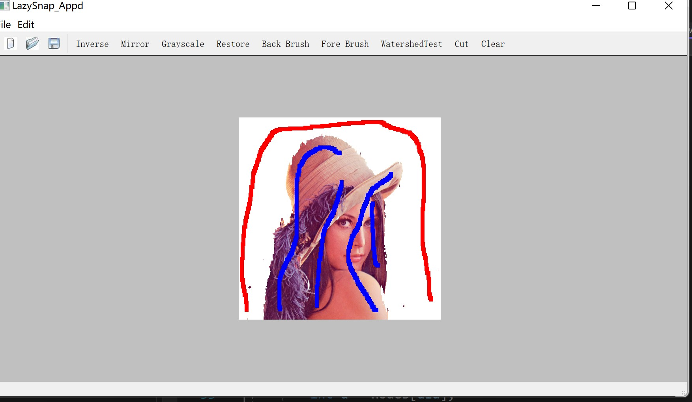

# LazySnaping

LazySnaping algorithm with pure C++ and Qt GUI

## implement method

in my blog [LazySnapping算法详解_lvzelong2014的博客-CSDN博客](https://blog.csdn.net/lvzelong2014/article/details/127646657?csdn_share_tail=%7B%22type%22%3A%22blog%22%2C%22rType%22%3A%22article%22%2C%22rId%22%3A%22127646657%22%2C%22source%22%3A%22lvzelong2014%22%7D)

## ENV

> Qt5
> 
> Eigen3
> 
> maxflow
> 
> Visual Studio C++

## how to install

```
mkdir build
cd build
cmake ..
```

## Core Code

in src/App/

kmeans.h,kmeans.cpp for kmeans algorithm

watershed.h for watershed algorithm

LazySnap.h LazySnap.cpp for main algorithm

## how to use

mainwindow like this

use open to load an image, and then choose Back/Fore Brushes , select the region and Click Cut

resutl like this


